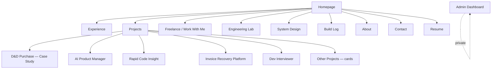
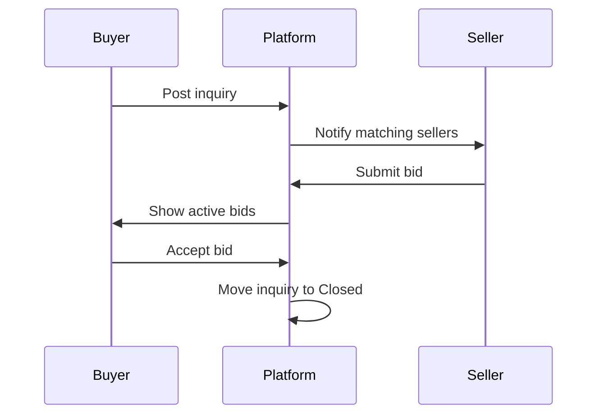

# Karan Patel — Portfolio Strategy & Build Plan

**Legend used throughout this document:**
🟢 Verified fact (from your input) · 🔵 Strategic recommendation · 🟡 Assumption (labeled, needs your confirmation) · 🔴 Missing — must confirm before publishing

---

## 1. Executive Summary

**What this portfolio becomes:** a working demonstration of how you build backend systems, not a résumé wrapped in a website. The site itself — its architecture, its API, its performance — is Exhibit A. Every "impressive" feature earns its place only if it proves something true about your work (query optimization, system design, production ownership). Nothing is decorative.

**Central concept:** *An engineer's control room.* Visitors don't read about your work — they inspect it, the way you'd inspect a running system: architecture diagrams they can click into, an API they can hit, a build log that reads like real engineering notes instead of a blog.

**Strongest differentiator:** Most junior/early-career backend portfolios show project cards with tech-stack badges. Yours will show *systems* — request flows, database decisions, failure handling, and one real commercial B2B platform (D&D Purchase) with actual production trade-offs. That's rare at your stage and is your single biggest credibility lever.

**Impression it should create:** "This person already thinks like a backend engineer with production experience, not a bootcamp grad with project cards."

**Primary goals, ranked by what the site should optimize for:**
1. Backend/Python/FastAPI/full-stack job shortlisting (highest near-term leverage — you have real intern experience + metrics)
2. Freelance client acquisition (D&D Purchase is your proof; needs a dedicated, non-generic presentation)
3. Personal brand / recognition (secondary — grows from #1 and #2, not the other way around)
4. Proving "business problem → production system" thinking (this is the thread that ties the whole site together)

---

## 2. Positioning Strategy

**Primary positioning:** Backend Engineer (Python / FastAPI) with full-stack range and applied AI experience.

**Secondary positioning:** Freelance full-stack developer who owns projects end-to-end — requirements through deployment — for small businesses and founders.

🔵 Do **not** lead with "AI Engineer" as your primary identity. Your verified AI work (LLM integrations, RAG, embeddings) is real but currently secondary to your backend depth (intern role, D&D Purchase, measurable DB optimization). Leading with AI when your strongest verified proof is backend/API work creates a positioning mismatch recruiters will notice. AI should be a strong *secondary* pillar, not the headline.

**Target roles:** Backend Developer, Python Developer, FastAPI Developer, Full-Stack Developer (backend-leaning), Junior/Associate Software Engineer. AI Engineer roles are a stretch target — support with the AI project section, not the homepage headline.

**Target freelance clients:** early-stage founders and small businesses needing a working MVP, an internal business tool (like D&D Purchase), or backend/API work on an existing product. Not enterprise clients — you don't have the proof for that yet, and claiming it would hurt credibility.

**What you should be known for:** shipping complete, working backend systems for real businesses; measurable database optimization; taking ownership beyond your assigned scope.

**What you should NOT claim:**
- 🔴 Do not claim "scalable," "enterprise-grade," or specific user/traffic numbers for any project unless you have the data to back it.
- Do not claim senior-level system design experience — you have one internship. Frame it as "production experience," not "years of scale."
- Do not overstate AI expertise beyond integration work (using APIs, building RAG pipelines) — you haven't listed model training/fine-tuning experience.

**Strongest proof points (in order):**
1. 🟢 D&D Purchase — live, paid, commercial B2B platform, end-to-end delivery
2. 🟢 Magenta Connects internship — 10+ FastAPI endpoints, ~30% DB response time improvement, 15+ production bugs resolved
3. 🟢 Multiple deployed AI products (AI Product Manager, Dev Interviewer, etc.) — breadth of applied AI
4. 🟢 Full stack range (React/Next.js through PostgreSQL/Redis/Docker)

---

## 3. Audience Analysis

| Audience | Cares about | Sees first | Action wanted | Trust killers | Site adaptation |
|---|---|---|---|---|---|
| **Recruiters** | Fast signal: role fit, stack match, real experience | Hero + "what I do" line + top 3 proof points | Download resume, view experience, contact | Vague buzzwords, unclear role fit, slow site | 15-second homepage scan path; resume always one click away |
| **Engineering managers** | How you *think* — trade-offs, failure handling, DB decisions | Experience section → System Design section | Read a full case study | Hand-wavy architecture, no real trade-offs discussed | Deep technical case studies with real decisions, not just feature lists |
| **Founders/freelance clients** | Can this person solve MY business problem and not disappear mid-project | Work-With-Me page or D&D Purchase case study | Submit inquiry / book a call | Overly technical jargon with no business framing, no clear process | Business-outcome framing first, technical depth available on click-through |
| **Developers / online audience** | Genuine technical content, not marketing fluff | Build log / engineering lab | Follow, share, read case study | Generic "10 tips" content, unverified claims | Build log written like real notes; open architecture diagrams |

---

## 4. Creative Concept

### Option A — "Engineer's Control Room" (🔵 Recommended)
- **Core idea:** The site behaves like a lightweight internal tool an engineering team would actually use — clean panels, real data, a command palette, a system status indicator.
- **Visual metaphor:** A monitoring dashboard for one engineer's body of work.
- **UX:** Calm, information-dense but not cluttered; hero is a live "system status" style intro (no boot animation delay); project pages act like service pages in an internal dashboard.
- **Advantages:** Differentiates instantly, reinforces backend/systems identity, scales well for both recruiter skimmers and technical deep-divers.
- **Risks:** Can tip into gimmicky if overbuilt; must stay restrained (see Section 39).
- **Suitability:** Excellent — matches your actual strength (backend systems thinking) rather than borrowing a metaphor you'd have to justify.

### Option B — "Architecture Explorer"
- **Core idea:** The whole portfolio is framed as a set of system diagrams you can click into — homepage *is* a top-level architecture diagram of "Karan's work."
- **Visual metaphor:** A living system diagram (nodes = projects, experience, skills).
- **UX:** Highly visual, React Flow-driven navigation.
- **Advantages:** Extremely memorable, directly demonstrates system-design thinking.
- **Risks:** Higher dev effort, real risk of poor mobile UX and accessibility (node-graph navigation is hard on small screens), can feel like a gimmick if content underneath is thin.
- **Suitability:** Good as a *feature inside* Option A (e.g., one page), risky as the entire site's navigation model.

### Option C — "Build Log as Product"
- **Core idea:** Center the site around a chronological engineering journal; projects and experience are entries in the log.
- **Visual metaphor:** A technical changelog / commit history.
- **UX:** Editorial, content-heavy, blog-adjacent.
- **Advantages:** Naturally supports personal branding and content strategy (Section 20).
- **Risks:** Weaker for the 15-second recruiter scan — recruiters don't want to read a log to find your stack.
- **Suitability:** Good as a secondary section, weak as the primary concept for job-hunting goals.

**Final recommendation: Option A, with a lightweight version of Option B's "click into architecture" idea used inside individual case studies (not as global navigation), and Option C folded in as the Build Log section.**

---

## 5. Brand Strategy

🔵 **Recommended brand name:** **Karan Patel** (your real name, not a persona brand like "Karan Engineering Lab"). At this career stage, name recognition compounds faster under your real name — recruiters search your name, not a brand. Use `karanpatel.dev` (or `.com`) as domain if available; check availability.

- **Professional title:** Backend Engineer · Python / FastAPI
- **Homepage headline (example copy):** "I build backend systems that businesses actually run on."
- **Supporting statement:** "Python and FastAPI engineer with production experience — from optimizing databases at Magenta Connects to shipping a live B2B platform for a paying client."
- **One-line pitch:** "Backend-focused full-stack engineer who ships complete, working systems — not just endpoints."
- **Short bio (≈40 words):** "Karan Patel is a backend-focused full-stack engineer specializing in Python and FastAPI. He's built production APIs as a backend intern at Magenta Connects and delivered D&D Purchase, a live B2B buyer-seller platform, as an independent freelance developer."
- **Longer bio (≈120 words, for About page):** "I'm a backend engineer who cares more about whether a system actually works in production than how it looks in a slide deck. As a Backend Developer Intern at Magenta Connects, I built and shipped 10+ FastAPI endpoints, cut average database response time by roughly 30% through indexing and query restructuring, and resolved 15+ production issues. Outside that, I've worked as a freelance full-stack developer — my strongest project, D&D Purchase, is a live B2B platform with separate buyer and seller workflows that I took from requirements to deployment for a paying client. I also build applied-AI tools on the side (RAG pipelines, document processing, AI agents) because I like understanding how new tools actually get used, not just how they demo."
- **Freelance pitch:** "I take a business problem — an internal tool, an MVP, a broken API — and own it end-to-end: requirements, architecture, build, deployment, and handover."
- **Social bio (X/LinkedIn, ≤160 chars):** "Backend Engineer · Python & FastAPI · Building production systems + occasional AI tools · Freelance available"
- **Tone of voice:** direct, technically precise, no hype. Short sentences. Numbers over adjectives.
- **Brand adjectives:** precise, grounded, systems-minded, dependable, unshowy.
- **Content pillars:** (1) backend engineering notes, (2) system design breakdowns of your own projects, (3) freelance/client-work lessons, (4) applied-AI experiments.

---

## 6. Visual Design System

🔵 Evaluation of your proposed direction: your instinct (dark, restrained, engineering-pattern-based) is correct and fits the "control room" concept. Recommendation below refines it — one accent, not two, for the MVP, to avoid the "two competing accent colors" problem common in dark portfolios.

| Token | Value | Notes |
|---|---|---|
| Background (base) | `#0A0B0D` | Near-black, not pure black — reduces harsh contrast fatigue |
| Surface | `#131417` | Cards, panels |
| Surface elevated | `#1B1D21` | Modals, command palette |
| Border | `#2A2D33` | Subtle, 1px |
| Primary accent | `#3B82F6` (electric blue) | Links, primary CTAs, active states |
| Secondary accent | `#10B981` (emerald) — used sparingly | Success states, "live" indicators only — not decorative |
| Warning | `#F59E0B` | Rarely used — availability status, alerts |
| Error | `#EF4444` | Form errors only |
| Text primary | `#E6E7EA` | Body copy |
| Text secondary | `#8A8D96` | Captions, metadata |
| Text mono/technical | `#9CA8FF` | Stack labels, code, technical tags |

**Typography pairing:** Space Grotesk (headings) + Inter (body) + JetBrains Mono (technical labels, stack tags, code blocks). 🔵 Drop Satoshi/Geist from the shortlist — Space Grotesk + Inter is a proven, distinct, highly legible pairing and adding a third display font increases decision overhead without adding differentiation.

- **Font sizes:** modular scale, base 16px, ratio 1.25 (16/20/25/31/39/49px for h5→h1).
- **Spacing system:** 4px base unit (4/8/12/16/24/32/48/64/96).
- **Border radius:** 8px for cards, 4px for buttons/inputs — small and consistent, not the heavy 20px+ "SaaS bubble" look.
- **Shadows:** minimal; prefer 1px borders + subtle inner glow on hover over drop shadows (fits dark theme better).
- **Glow usage:** reserve for exactly one thing — the "live/available" status indicator and active nav state. If everything glows, nothing signals.
- **Icon style:** Lucide icons (matches your stated stack), 1.5px stroke, no filled icons.
- **Illustration style:** none. Use real architecture diagrams instead of illustrations — this reinforces the "engineer, not designer-persona" positioning.
- **Diagram style:** node-and-edge, monospace labels, primary-accent-colored edges on hover.
- **Buttons:** solid primary-accent for primary CTA, ghost/outline for secondary — max one solid-filled button visible per view.
- **Cards:** flat surface color + 1px border, no drop shadow, hover = border color shifts to accent + slight elevation via background lightening (not shadow).
- **Forms:** dark inputs, visible focus ring in primary accent, inline validation.
- **Dark-mode behaviour:** dark is the only mode for v1 — a light-mode toggle is unnecessary scope for a portfolio (see Section 39).
- **Reduced-motion behaviour:** all animation respects `prefers-reduced-motion`; diagrams and transitions fall back to instant state changes.

---

## 7. Complete Sitemap

| Page | Status |
|---|---|
| Homepage | Essential — MVP |
| Experience | Essential — MVP |
| Projects (index) | Essential — MVP |
| D&D Purchase case study | Essential — MVP |
| Other project case studies (2–3 more) | Essential — MVP |
| Remaining project cards (no full case study) | Essential — MVP |
| Work With Me / Freelance | Essential — MVP |
| Contact | Essential — MVP |
| Resume (download) | Essential — MVP |
| About | Recommended — v2 |
| System Design | Recommended — v2 |
| Build Log | Recommended — v2 |
| Engineering Lab (interactive demos) | Recommended — v2 |
| Admin Dashboard | Optional — advanced |
| AI Portfolio Assistant | Optional — advanced |

---

## 8. Homepage Information Architecture

| Section | Purpose | Audience | Heading (example) | UI pattern | CTA |
|---|---|---|---|---|---|
| Hero | Identity + role fit in <15s | All | "I build backend systems that businesses actually run on." | Status-panel style hero | Resume / Contact |
| Proof strip | Instant credibility | Recruiters, EMs | "Production experience, not just projects" | 3 stat chips (10+ endpoints, ~30% faster queries, 15+ prod bugs fixed) | — |
| Experience preview | Real employer proof | Recruiters, EMs | "Backend Developer Intern — Magenta Connects" | Compact timeline card | "View full experience" |
| Featured work | Commercial proof | Founders, EMs | "Selected work" | 2–3 large project cards (D&D Purchase first) | "View case study" |
| Stack | Fast technical scan | Recruiters | "Core stack" | Grouped monospace tag list (no % bars) | — |
| Freelance CTA | Client conversion | Founders | "Need something built?" | Short pitch + CTA block | "Work with me" |
| Footer / contact | Conversion | All | — | Links + contact | Email / LinkedIn / GitHub |

Mobile: same order, stat chips stack vertically, project cards go full-width single column.

---

## 9. Hero Section

- **Headline:** "I build backend systems that businesses actually run on."
- **Supporting copy:** "Backend-focused full-stack engineer specializing in Python and FastAPI. Currently open to backend/full-stack roles and select freelance projects."
- **Primary CTA:** "View Resume" (or "Download Resume")
- **Secondary CTA:** "See D&D Purchase →" (your strongest proof, one click from hero)
- **Availability indicator:** small live-style dot + text: "Open to full-time opportunities & freelance work" — 🟢 confirmed current status.
- **Social proof:** the 3 stat chips from Section 8 (endpoints shipped, DB improvement %, bugs resolved) — 🟢 all verified from your input.
- **Engineering visual:** a small, static-by-default architecture snippet (e.g., a simplified request-flow diagram) that subtly animates on hover/scroll — not a full animated system on load.
- **Interaction:** no boot-sequence delay (see Section 39). Content is visible immediately; a subtle 200–400ms fade/slide-in is enough.
- **Layout:** Desktop — two-column (copy left, diagram right). Tablet — stacked, diagram below copy, slightly simplified. Mobile — stacked, diagram becomes a static simplified graphic, no interaction required.
- **Accessibility:** all animated elements respect reduced-motion; diagram has a text-equivalent summary for screen readers.

---

## 10. Experience Section (Magenta Connects)

**Content hierarchy:**
1. Role, company, duration 🟢
2. One-line role summary
3. Key metrics (3 max)
4. What you built
5. What you owned/fixed
6. Tools used
7. Architecture snippet (optional, small)

**Suggested wording:**
> **Backend Developer Intern — Magenta Connects Pvt. Ltd.** · Dec 2025 – Jun 2026
> Built and maintained Python backend systems, shipping 10+ FastAPI endpoints with strict Pydantic schema validation. Improved average database response time by ~30% through indexing and query restructuring across MySQL and MongoDB. Resolved 15+ production issues and worked directly in Docker-based deployment environments.

**Metrics to show:** 10+ endpoints, ~30% DB response time improvement, 15+ production issues resolved. 🟢 all stated by you — do not round up further.

**Technical evidence:** describe (don't screenshot proprietary code) — e.g., "restructured a MongoDB aggregation pipeline that was causing slow report generation" as a short narrative, no actual client code/data shown. 🔴 Confirm what, if anything, you're allowed to describe publicly per your internship's confidentiality terms.

**What can be shown publicly vs. not:**
- ✅ Technologies used, general problem descriptions, metrics you personally verified
- 🔴 Do not show company-internal architecture diagrams, real endpoint names/routes, client names, or code without written permission from Magenta Connects.

**What should not be overstated:** don't imply you owned the full system — you were an intern on a team. "Owned problems beyond individual tasks" (your words) is honest; "led backend architecture" would not be.

---

## 11. Freelance Section

- **Positioning:** "I take freelance backend/full-stack projects for founders and small businesses who need something built and shipped, not just prototyped."
- **Services** (see Section 15 for full detail): backend/API development, SaaS MVP builds, business applications, AI product integration, workflow automation.
- **Commercial work:** D&D Purchase is the anchor case study — must be visually distinguished from personal/AI side projects (different card treatment, "Client Work" tag).
- **End-to-end ownership:** requirements → architecture → build → deploy → revisions → handover — state this explicitly, it's a real differentiator at your career stage.
- **Client process:** see Section 17.
- **Availability:** dynamic but simple — a text status you update manually (`Available` / `Booked until [date]` / `Not currently taking freelance work`). 🔵 Skip a fully automated availability system for v1 — it's not worth the engineering cost (see Section 39).
- **Project inquiry CTA:** "Start a project" → links to Work-With-Me form.
- **Trust-building elements:** D&D Purchase live link, honest process description, realistic response-time expectation (e.g., "I typically reply within 1–2 business days").
- **Distinguishing paid client work from personal projects:** consistent tag system — `Client Work` vs. `Personal Project` vs. `AI Experiment` shown on every card, no exceptions.

---

## 12. D&D Purchase — Case Study Plan

- **Title:** "D&D Purchase — B2B Buyer-Seller Platform"
- **One-line description:** "A live commercial platform connecting business buyers and sellers through structured inquiry and bidding workflows."
- **Classification:** Client Work · Commercial · Live
- **Business problem:** 🟡 Assumption — buyers and sellers in a B2B market needed a structured way to post inquiries, receive competitive bids, and manage the deal lifecycle instead of doing it over email/phone. 🔴 Confirm actual problem statement with client-appropriate framing.
- **Client requirement:** 🔴 Confirm what you can state publicly — likely: a platform supporting distinct buyer and seller roles, inquiry-to-bid workflows, and account management.
- **Target users:** business buyers and sellers (B2B, not consumer).
- **Your role:** freelance full-stack developer — 🟢 you stated you handled major parts of end-to-end delivery (requirements, planning, implementation, testing, deployment, revisions, client communication).
- **Key features** 🟢: buyer inquiries, seller bidding, active/closed bidding states, product management, buyer/seller profiles, account settings, Google account connection, secondary email support, buyer identification codes, role-based functionality.
- **User roles:** Buyer, Seller (and likely Admin — 🔴 confirm).
- **Workflow (example, confirm accuracy):**

- **Architecture (confirmed 🟢):** React + TypeScript frontend; Node.js + Express.js + TypeScript backend; MongoDB database; Firebase Authentication (incl. Google account linking + secondary email support); Firebase hosting/deployment.
- **Data model areas:** Users (buyer/seller), Inquiries, Bids, Products, Accounts/Profiles.
- **Technical challenges (frame honestly):** role-based access control across two distinct user types; managing inquiry/bid state transitions; secondary email + Google account linking on one identity.
- **Business value:** replaces informal buyer-seller communication with a structured, trackable process. 🔴 Do not state revenue/efficiency numbers unless you have them from the client.
- **Screenshots required:** dashboard views for buyer and seller, inquiry flow, bidding screen, profile/settings.
- **Demo ideas:** short screen-recording walkthrough (60–90s) of the inquiry → bid → accept flow, no client data shown if confidential.
- **Metrics to collect (going forward):** none should be invented; if you can get client permission, ask for: approximate number of active inquiries/bids, any qualitative feedback.
- **Testimonial strategy:** 🔴 request a short written quote from the client — even 2–3 sentences adds significant trust. Do not publish without explicit permission.
- **CTAs:** "View live site →", "Discuss a similar project"
- **SEO title:** "D&D Purchase — B2B Buyer-Seller Platform Case Study | Karan Patel"
- **SEO description:** "How I built D&D Purchase, a live B2B platform with buyer inquiry and seller bidding workflows, from requirements to deployment."
- **OG image concept:** dark card with platform screenshot + "Client Work · Live" tag + your name.

🟢 **Confidentiality boundaries (confirmed):** covered by an NDA with the client. Publicly OK: general purpose, your responsibilities, high-level architecture, technologies used. NOT OK: confidential client/business info, internal business logic, sensitive workflow detail, source code, DB structure, credentials, private dashboards, or screenshots containing real customer/transaction data. Screenshots limited to already-public pages or sanitized/redacted screens only.

---

## 13. Other Project Case Studies

| Project | Full case study or card? | Positioning | Strongest proof | Missing info | CTA |
|---|---|---|---|---|---|
| AI Product Manager 🟢 | Full case study | Applied-AI product thinking | Live + GitHub, real product scope | Specific features/results | "View live", "View code" |
| Rapid Code Insight 🟢 | Full case study | Developer-tooling / AI code understanding | Live product, dev-tool relevance for recruiters | Exact feature set | "View live" |
| Invoice Recovery Platform 🟢 | Full case study | Business-application / AI-adjacent | Clear business use case (receivables) | Confirm your role/ownership % | "View live" |
| Dev Interviewer 🟢 | Card, could grow to case study | AI interview prep tool | Live, relatable use case | Feature specifics | "View live" |
| NGO Health App 🟢 | Card | Applied full-stack, social-good angle | Live | Purpose/impact details | "View live" |
| Restaurant Food App 🟢 | Card | Full-stack fundamentals | GitHub only | No live link — mention as code sample | "View code" |
| AI Voice Agent / Telephony 🟢 | System Design write-up, not project card | Concept/architecture depth (Telnyx/Twilio, multi-region) | Strong system-design story even without a public live product | No live deployable demo | "Read design doc" |
| PayGuard AI 🟡 | Do not publish yet | Unclear — insufficient verified detail | None yet | 🔴 Features, status, whether it's live | Hold until confirmed |

🔵 Rule: nothing without a live link, GitHub link, or verifiable detail gets a "full" case study — it gets a small card or is held back entirely (PayGuard AI, until confirmed).

---

## 14. Project Presentation System

**Categories:** Client Work · Production Systems · AI Products · Business Applications · Developer Tools · System Designs

**Card structure:**
- Thumbnail (real screenshot, not stock/illustration)
- Category tag (monospace, small)
- One-line value proposition
- Your role
- Stack (3–5 key tags max, not the full list)
- Status (`Live` / `In Development` / `Concept`)
- Metric if verified (optional — omit rather than invent)
- Hover: reveals architecture-snippet preview or key feature list
- Mobile: tap reveals same info inline, no hover dependency

🔵 D&D Purchase gets a visually larger/first-position card — do not present all projects at equal visual weight (you explicitly want to avoid this).

---

## 15. Services Section

| Service | Client problem | You deliver | Stack | Proof | Public? |
|---|---|---|---|---|---|
| Backend & API development | "Our backend is fragile / we need one built" | FastAPI/Django backend, validated APIs | FastAPI, Pydantic, PostgreSQL | Magenta Connects, D&D Purchase | Yes |
| SaaS MVP development | "I have an idea, need it built" | Full-stack MVP, deployed | Next.js + FastAPI/Node + Postgres | D&D Purchase, AI Product Manager | Yes |
| Custom business applications | "We manage X in spreadsheets/email" | Structured internal tool | Full stack | D&D Purchase, Invoice Recovery | Yes |
| AI product integration | "We want AI in our product" | RAG/LLM integration | Gemini API, vector DBs, embeddings | AI Product Manager, Dev Interviewer | Yes |
| Workflow automation | "This manual process wastes time" | Background jobs, automation | Celery, Redis, RabbitMQ | Internship experience | Yes |
| Database optimization | "Our queries are slow" | Indexing, query restructuring | PostgreSQL/MySQL/MongoDB | ~30% improvement metric | Yes |

🔵 Drop "technical documentation" and "deployment/maintenance" as standalone *listed* services for v1 — fold them into the other services as included deliverables rather than separate line items; too many services dilutes focus for a new freelancer.

---

## 16. Work-With-Me Page

- **Who I work with:** early-stage founders, small businesses, teams needing backend/API help.
- **Problems I solve:** listed from Section 15.
- **Selected work:** D&D Purchase + 1–2 others.
- **Process:** Section 17.
- **Engagement models:** fixed-scope project (most common at your stage) — 🔵 avoid offering hourly/retainer until you have more freelance track record; fixed-scope is easier to sell and deliver confidently.
- **Availability:** manual status text.
- **FAQ (examples):** "Do you work with early-stage/no-code-to-code projects?", "Do you sign NDAs?", "What's your typical timeline?", "Do you offer ongoing support after launch?"
- **Project request form fields:** Name, Email, Project type (dropdown), Brief description (textarea), Budget range (dropdown, not exact figure — see below), Timeline (dropdown), How did you find me (optional).
- **Budget field strategy:** use ranges (e.g., "<$1k", "$1k–3k", "$3k–8k", "$8k+", "Not sure yet") — reduces friction vs. asking for an exact number, and filters serious inquiries.
- **Timeline field strategy:** ranges too ("ASAP", "Within a month", "1–3 months", "Flexible").
- **Trust/privacy copy:** short line stating you won't share project details publicly without permission.
- **Confirmation screen:** simple "Thanks — I'll reply within 1–2 business days" (🔴 confirm real response time you can commit to).

🔵 Do not promise guarantees ("100% satisfaction," "on-time delivery guaranteed") — these read as inexperienced and are hard to back up.

---

## 17. Client Process

| Stage | What happens | Deliverable | Client involvement | Communication |
|---|---|---|---|---|
| Discovery | Initial call/message, understand the ask | Notes | High | Email/call |
| Requirement analysis | Clarify scope, constraints | Written requirements doc | High | Async doc |
| Scope & estimate | Define what's in/out, timeline | Proposal | Medium | Email |
| Architecture | Decide stack, data model | Simple architecture doc | Low | Shared doc |
| Development | Build in milestones | Working increments | Low–medium (check-ins) | Weekly update |
| Review | Client tests progress | Feedback | High | Call/async |
| Testing | QA, edge cases | Test notes | Low | — |
| Deployment | Ship to production | Live product | Medium | Handover call |
| Handover | Docs, access transfer | README/docs, credentials | High | Call + doc |
| Support (optional) | Post-launch fixes | Agreed support window | Low | Email |

---

## 18. Engineering Lab

| Demo | Purpose | Real or simulated | Security concern | Effort | MVP? |
|---|---|---|---|---|---|
| API request playground | Show real endpoint design skill | Real (rate-limited, read-only sandboxed endpoint) | Must be sandboxed, no write access | Medium | v2 |
| Database optimization demo (before/after query timing) | Directly demonstrates your strongest verified metric | Simulated with real, pre-recorded query plans | None if simulated | Medium | v2 — high value |
| Queue-processing visualizer | Shows Celery/RabbitMQ understanding | Simulated | None | Medium | Later |
| Rate limiter simulation | Shows backend defensive design | Simulated | None | Low–medium | Later |
| AI retrieval (RAG) pipeline demo | Shows AI integration skill live | Real, but capped/rate-limited (costs money per call) | Cost + abuse risk — needs strict rate limiting | High | Later, v3 |
| Background-job visualizer | Reinforces Celery/Flower experience | Simulated | None | Medium | Later |

🔵 **MVP priority: the database optimization demo only.** It directly visualizes your single best verified metric (~30% improvement) and is achievable without live infrastructure risk. Everything else is v2+.

---

## 19. System Design Section

| Topic | Why it belongs | Audience | Key sections |
|---|---|---|---|
| AI voice-agent backend (Telnyx/Twilio) 🟢 | You have real design experience here even without a live product — strong differentiator | EMs, recruiters | Architecture, call routing, multi-region telephony considerations, trade-offs |
| B2B bidding platform (D&D Purchase, generalized) | Reinforces your strongest commercial project from a systems angle | EMs | Data model, role-based access, state machine for bids |
| Invoice recovery / receivables system | Shows business-application system thinking | Founders, EMs | Workflow, reminder scheduling, data model |
| Reliable background-job system (Celery-based) | Shows infra maturity | EMs | Queue design, retries, failure handling |
| API rate limiter | Common, well-understood system-design topic that's easy to write well | EMs, recruiters | Algorithm choice, trade-offs |

🔵 Skip "multi-tenant SaaS platform" and "notification system" for v1 — you don't have verified hands-on experience with either; writing them speculatively risks looking generic/copied from tutorials.

---

## 20. Personal Branding & Growth Strategy

- **Positioning:** consistent with Section 5 — backend engineer, real production experience, applied AI on the side.
- **Content pillars:** backend engineering notes, system-design breakdowns of your own work, freelance/client lessons, applied-AI experiments.
- **LinkedIn strategy:** post 1x/week, mix of: a lesson from Magenta Connects work (anonymized), a breakdown of a portfolio feature, a D&D Purchase insight.
- **GitHub strategy:** keep 3–5 repos genuinely polished (READMEs with architecture notes) rather than many half-finished ones.
- **X strategy:** short technical threads repurposed from LinkedIn posts; lower cadence is fine (2–3x/week).
- **Build-log strategy:** write short entries (200–400 words) as you build the portfolio itself — this content writes itself and is inherently authentic.
- **Case-study publishing:** publish D&D Purchase case study as a standalone shareable article too (LinkedIn article + site page).
- **Repurposing one project into multiple posts (example — D&D Purchase):** (1) "the role-based access decision," (2) "the bidding state machine," (3) "what I'd do differently now," (4) "client communication lessons."
- **Posting cadence:** realistic for a solo person — 1 LinkedIn post/week, 2–3 X posts/week, 1 build-log entry every 1–2 weeks. Do not commit to daily content.
- **How the site supports growth:** every case study and build-log post needs its own shareable URL + OG image.
- **Metrics to track:** LinkedIn/X engagement, referral traffic to site, resume downloads, inquiry form submissions.

---

## 21. AI Portfolio Assistant

- **Value:** novel, demonstrates RAG skills directly, memorable for recruiters.
- **Risks:** hallucination about your experience is a serious credibility risk — this is the single biggest danger of this feature.
- **Recommended scope (v1):** strictly RAG over your own published site content only (case studies, experience, projects) — no open-ended "ask me anything about Karan" without grounding.
- **Knowledge sources:** your site's own case studies, experience section, project descriptions — nothing outside published content.
- **Retrieval architecture:** simple embeddings + vector search (you already know Qdrant) over site content, small context window, low temperature.
- **Citation system:** every answer must link back to the source section on the site — no unsourced claims.
- **Prompt design:** system prompt explicitly instructs the model to say "I don't have that information" rather than infer/guess.
- **Rate limiting:** required — cap requests per IP/session to control cost and abuse.
- **Privacy:** don't log identifiable visitor data beyond what's needed for rate limiting; state this in a short privacy note near the assistant.
- **Guardrails:** refuse to answer questions unrelated to your portfolio; refuse to generate claims not present in source content.
- **UI:** small chat widget, not a full takeover of the homepage.
- **Example questions:** "What backend work has Karan done?", "Tell me about D&D Purchase", "Is Karan open to freelance work?"
- **MVP complexity:** medium-high.
- **Recommendation: this is a v3 (advanced) feature, not MVP** — build it after the core case studies exist, since it has nothing to retrieve from until then, and a hallucinating assistant before launch would actively hurt trust.

---

## 22. Command Palette

**Recommended commands:**
- Open D&D Purchase case study
- View experience (Magenta Connects)
- Download resume
- View GitHub
- View AI projects
- Open Engineering Lab
- Contact Karan
- View availability
- Search projects

**Access:** `Cmd/Ctrl + K` on desktop; on mobile, a small persistent search/command icon in the nav (no keyboard shortcut equivalent — mobile users tap it directly). 🔵 This is a nice-to-have that fits the "control room" concept well and is relatively low effort with libraries like `cmdk` — reasonable for MVP+1, not blocking launch.

---

## 23. Admin Dashboard

- **MVP features:** edit project status/availability text, view contact-form submissions.
- **v2 features:** manage build-log posts, track resume downloads, manage testimonials.
- **Authentication:** single-user auth (just you) — simple session-based auth is sufficient, no need for complex role systems.
- **Roles:** one role (owner) — no multi-user complexity needed.
- **Database entities:** ContactRequests, AvailabilityStatus, BuildLogPosts (if not using MDX), ResumeDownloadEvents.
- **Security:** strong password + rate-limited login, HTTPS only, no admin route indexed by search engines.
- **Is a custom admin worth building?** ~~Not for MVP~~ — superseded: user wants to add/edit all content (projects, experience, copy, etc.) without touching code, so the admin panel is built from day one. See `IMPLEMENTATION-PLAN.md`'s "Admin Panel (CMS)" section for the full design.

---

## 24. Technical Architecture

🟢 **Confirmed decision:** build the FastAPI backend from day one (user's explicit choice, overriding the static-MDX-only recommendation below). This doubles as another live proof point of backend skill on the portfolio itself.

| Layer | MVP (revised) | v2 | Advanced |
|---|---|---|---|
| Frontend | Next.js + TypeScript + Tailwind | + Framer Motion, Shadcn UI | + React Flow for interactive diagrams |
| Backend | FastAPI from day one (contact form, availability, resume-download tracking, projects/case-studies API) | + Celery for async tasks | + Celery for AI assistant (v3) |
| Content | MDX/JSON for case-study copy, served through FastAPI where dynamic (status, contact) | PostgreSQL for dynamic content | Headless CMS only if content volume grows a lot |
| Database | PostgreSQL (Neon or Supabase — free tier) from day one | Same | + Redis (Upstash) for caching/rate limiting |
| Analytics | Umami or Vercel Analytics (privacy-friendly) | Same | + PostHog if you want funnel analysis |
| Monitoring | None | Sentry (error tracking) | + Prometheus/Grafana only if you build the Engineering Lab's real demos |
| Email | Resend (contact form notifications) | Same | — |
| File storage | Static (in-repo images) | Cloudinary (if many dynamic images) | — |
| Hosting | Vercel (frontend) + Railway/Render (FastAPI backend) | Same | AWS only if you have a specific reason |
| CI/CD | Vercel auto-deploy (frontend) + GitHub Actions (backend) | Same | — |
| Domain/DNS | `karanpateldev.indevs.in` — point at Vercel via CNAME/A record | Same | — |

**Original v1 recommendation (superseded):** ~~Do not build the FastAPI backend for v1; static/MDX only, add backend in v2.~~ User opted to build FastAPI + Postgres from day one instead — noted here for context on why Sections 25/26 (originally "v2") now apply to the MVP.

---

## 25. Data Model (MVP — backend built from day one, see Section 24)

| Table | Key fields | Relationships | Indexes | Public/Private |
|---|---|---|---|---|
| projects | id, slug, title, category, status, stack[], summary | → project_media | slug (unique) | Public |
| case_studies | id, project_id, content(mdx/json), seo_title, seo_desc | → projects | project_id | Public |
| experience | id, company, role, start_date, end_date, summary, metrics[] | — | — | Public |
| contact_requests | id, name, email, message, budget_range, timeline, created_at | — | created_at | Private |
| build_log_posts | id, slug, title, content, published_at | — | slug | Public |
| testimonials | id, project_id, quote, author, permission_granted (bool) | → projects | project_id | Public (only if permission_granted=true) |
| resume_downloads | id, timestamp, referrer | — | timestamp | Private |
| availability | id, status_text, updated_at | — | — | Public |

---

## 26. API Plan (MVP — backend built from day one, see Section 24)

| Endpoint | Method | Purpose | Auth | Notes |
|---|---|---|---|---|
| `/api/projects` | GET | List projects | None | Public, cached |
| `/api/projects/{slug}` | GET | Project detail | None | Public, cached |
| `/api/contact` | POST | Submit inquiry | None | Rate-limited, validated (Pydantic), spam-checked |
| `/api/availability` | GET | Current status | None | Public, cached |
| `/api/availability` | PUT | Update status | Admin session | Owner-only |
| `/api/resume/track` | POST | Log download event | None | Rate-limited, no PII stored |
| `/api/admin/login` | POST | Admin auth | — | Rate-limited, lockout after failed attempts |
| `/api/admin/contact-requests` | GET | View inquiries | Admin session | Private |

---

## 27. Content Management Strategy

🔵 **MVP: MDX + JSON files in the repo.** No database, no CMS. This is the correct choice at your current content volume (handful of projects, one detailed case study) — it's fast, free, version-controlled, and requires zero backend.

**v2+:** migrate dynamic/frequently-changing content (contact requests, availability, resume tracking — things that need a database anyway) to PostgreSQL, while keeping case study *content* in MDX for easy editing without a CMS UI. Only consider a headless CMS if you start publishing build-log content frequently enough that editing MDX files becomes a real friction point — unlikely at your stated posting cadence.

---

## 28. Animation & Interaction Plan

| Element | Trigger | Duration | Purpose | Reduced-motion fallback |
|---|---|---|---|---|
| Hero content entrance | Page load | 300–400ms fade/slide | Polish, not delay | Instant appearance |
| Nav active state | Route change | 150ms | Orientation | Instant |
| Project card hover | Hover/tap | 150ms border/elevation shift | Affordance | No transition, instant state |
| Architecture diagram node hover | Hover | 150ms highlight | Reveal detail | Detail shown via tap, no animation |
| Command palette open | Keypress/tap | 150ms | Fast utility, not spectacle | Instant open |
| Stat counters | Scroll into view | 600ms count-up | Emphasis on real metrics | Static numbers shown immediately |

🔵 Rule for all animation: if it takes longer than ~400ms or delays access to content, cut it. No boot sequences, no scroll-jacking, no full-page transition animations.

---

## 29. Responsive Design Plan

- **Large desktop / laptop:** two-column layouts where relevant, full diagrams interactive.
- **Tablet:** single-column stacking, diagrams simplified, command palette icon-accessible.
- **Mobile:** full single-column, diagrams become static simplified graphics, code blocks horizontally scrollable with visible scroll affordance, tables become stacked key-value cards, navigation collapses to a hamburger + command palette icon, forms are full-width with large tap targets.
- **Small mobile:** ensure font sizes don't drop below 14px body text; avoid any horizontal overflow.

---

## 30. Accessibility Plan

- Minimum WCAG AA contrast ratios for all text/background combinations (verify the dark palette above against this — text primary `#E6E7EA` on `#0A0B0D` passes comfortably).
- Full keyboard navigation for command palette, nav, forms.
- Visible focus states (accent-colored ring) on every interactive element.
- Semantic HTML (proper heading hierarchy, `<nav>`, `<main>`, `<button>` vs `
`).
- Screen-reader text equivalents for all diagrams.
- Respect `prefers-reduced-motion` everywhere.
- Form errors announced via ARIA live regions, not color alone.
- Skip-to-content link.
- Code blocks: proper `<pre><code>` semantics, not styled `
`s.
- Touch targets ≥44px on mobile.

---

## 31. Performance Plan

- **Core Web Vitals targets:** LCP < 2.0s, CLS < 0.05, INP < 200ms.
- **Lighthouse target:** 90+ across Performance/Accessibility/Best Practices/SEO for MVP pages.
- **Images:** Next.js `<Image>` with proper sizing, WebP/AVIF.
- **Fonts:** self-hosted via `next/font`, subset where possible.
- **Code splitting:** route-based by default via Next.js App Router.
- **Lazy loading:** below-the-fold sections (Engineering Lab demos, later case-study content) lazy-loaded.
- **Animation performance:** CSS transforms/opacity only, avoid layout-thrashing properties.
- **No 3D content in v1** — not needed and a real performance risk on mobile.
- **API caching:** static generation (ISR) for project/case-study pages — they change rarely.
- **Bundle size:** avoid heavy libraries (React Flow, Framer Motion) on pages that don't need them via route-level code splitting.

---

## 32. SEO Strategy

- **Homepage title:** "Karan Patel — Backend Engineer (Python / FastAPI)"
- **Homepage description:** "Backend-focused full-stack engineer building production systems with Python and FastAPI. See real client work, backend projects, and case studies."
- **Project page metadata:** `{Project Name} — {one-line value prop} | Karan Patel`
- **Freelance page metadata:** "Hire Karan Patel — Backend & Full-Stack Freelance Developer"
- **Person schema:** JSON-LD `Person` with name, jobTitle, sameAs (LinkedIn, GitHub, X links 🟢).
- **Project schema:** `CreativeWork`/`SoftwareApplication` structured data per case study.
- **Sitemap:** auto-generated `sitemap.xml` via Next.js.
- **Robots:** allow all public pages, disallow `/admin`.
- **Canonical strategy:** self-referencing canonicals on all pages.
- **Internal linking:** every project links to related system-design/build-log content and vice versa.
- **Open Graph / social preview:** dynamic OG images per case study (project name + tag + screenshot).

---

## 33. Analytics & Success Metrics

Track: resume downloads, contact-form submissions, freelance inquiries (tagged separately from job-related contact), project-page views, live-project outbound clicks, GitHub/LinkedIn click-throughs, time on case studies, returning visitors, top traffic sources.

🔵 Use a privacy-friendly tool (Umami or Vercel Analytics) — no invasive tracking, no third-party ad pixels, consistent with your "no unnecessary infrastructure" preference.

---

## 34. Security & Privacy

- Server-side validation on all forms (Pydantic once backend exists).
- Spam protection: honeypot field + rate limiting on contact form (avoid CAPTCHA friction if possible).
- Rate limiting on all public API routes.
- Secrets in environment variables only, never committed.
- Admin auth: hashed passwords, session expiry, login attempt rate limiting.
- Secure, HTTP-only cookies for admin sessions.
- CORS restricted to your own domain.
- Basic CSP headers.
- Input sanitization on all user-submitted content.
- Minimal logging — no unnecessary PII retention.
- Short privacy notice on contact form and AI assistant (if built) explaining what's stored and why.
- Contact data retention: define a reasonable window (e.g., delete after 12 months of inactivity) — 🔴 confirm your own preference.

---

## 35. Development Roadmap

| Phase | Goal | Priority | Effort |
|---|---|---|---|
| 0 — Research & content collection | Gather all real content, confirm facts (Section 37/38) | Blocking | Medium |
| 1 — Brand & design system | Finalize palette, type, component library | High | Small–Medium |
| 2 — Core MVP | Homepage, Experience, Projects index, Contact, Resume | High | Large |
| 3 — Case studies | D&D Purchase + 2–3 others fully written | High | Large |
| 4 — Freelance pages | Work-With-Me, Services, Process | High | Medium |
| 5 — Interactive features | Command palette, DB optimization demo | Medium | Medium |
| 6 — Backend & admin | FastAPI backend, contact/availability/tracking | Medium | Large |
| 7 — AI assistant | RAG assistant over site content | Low (v3) | Large |
| 8 — Optimization & launch | Performance, accessibility, SEO pass | High (pre-launch) | Medium |
| 9 — Content growth | Build log, ongoing case studies | Ongoing | Small, recurring |

**Postponed from v1:** admin dashboard, AI assistant, most Engineering Lab demos, System Design section, full Build Log, node-graph navigation.

---

## 36. MVP Definition

**Must-have:** Hero, Experience (Magenta Connects), Projects index, D&D Purchase full case study, 2 more project case studies, Freelance/Work-With-Me page, Contact form, Resume download, mobile-responsive, accessible, fast (static site, no backend required).

**Should-have:** Command palette, About page, remaining project cards.

**Later:** Engineering Lab demos, System Design section, Build Log, Admin dashboard, AI assistant, backend/database.

**Avoid initially:** boot animations, node-graph global navigation, live/real API playground, availability automation, headless CMS.

**Launch requirements:** all copy fact-checked against Sections 2/12/13, all links working, Lighthouse 90+, resume up to date, D&D Purchase confidentiality confirmed.

---

## 37. Content Collection Checklist

- [ ] Updated resume (PDF)
- [ ] Professional photo (optional but recommended for About/hero credibility)
- [ ] D&D Purchase screenshots (buyer + seller flows) — with client permission
- [ ] Screenshots for other live projects (AI Product Manager, Rapid Code Insight, Invoice Recovery, Dev Interviewer, NGO Health App, Diksha)
- [ ] Confirmed, final project descriptions for each project (see Section 38 gaps)
- [ ] GitHub/live links verified working
- [ ] Final metrics confirmed (endpoints, % improvement, bugs resolved)
- [ ] Client permission/testimonial for D&D Purchase
- [ ] Confidentiality boundaries for Magenta Connects content
- [ ] Freelance process description finalized
- [ ] Current availability status (job + freelance)
- [ ] Contact email you want public
- [ ] Confirmed social links (🟢 LinkedIn, GitHub, X already provided)

---

## 38. Missing Information & Questions to Confirm

🟢 Resolved: #2 (D&D Purchase stack + confidentiality boundaries, see Section 12), #4 (availability — open to full-time + freelance), #5 (contact email: `mpkaranpatel001018@gmail.com`).

🔴 Still open — resolve before publishing the relevant sections:

1. Confidentiality/NDA status with Magenta Connects — what specifics can be shown publicly?
3. PayGuard AI — features, live status, whether it should be published at all yet.
~~6. Domain name~~ — 🟢 resolved: `karanpateldev.indevs.in`
7. Whether you have a professional photo, or prefer a no-photo/avatar-free design.
8. Realistic response-time commitment for the contact form ("within 1–2 business days" was used as a placeholder).
9. Contact data retention preference.
10. Any additional freelance projects beyond D&D Purchase that could support the freelance section (even smaller ones add credibility).

---

## 39. Risks & Mistakes to Avoid

| Risk | Prevention |
|---|---|
| Overdesign / gimmicky features | Every feature must map to a real proof point (Sections 4, 18) before it's built |
| Slow loading from heavy animation/3D | No 3D in v1; strict animation duration caps (Section 28) |
| Too many animations | One motion library used sparingly, reduced-motion respected everywhere |
| Unverified metrics | Only Section 2/10's verified numbers are used; nothing invented |
| Generic copy | All example copy above is specific to your real experience — do not swap in generic dev-portfolio phrases |
| Exaggerated experience | Intern-level framing stays intern-level; no "led," "architected the platform," etc. |
| Too many technologies listed at once | Stack tags per project limited to 3–5 most relevant, full list only on a dedicated page |
| Weak project explanations | Every case study follows the same structure (problem → role → decisions → outcome) |
| Fake testimonials | Only publish testimonials with explicit written permission |
| Inconsistent branding | Single brand file (Section 5/6) as source of truth for all copy/design decisions |
| Poor mobile design | Every section explicitly planned for mobile (Sections 9, 29) |
| Complex infrastructure too early | No backend in MVP (Section 24); admin dashboard and AI assistant deferred |
| AI chatbot hallucinations | Strict RAG-only grounding + citations, deferred to v3 (Section 21) |
| Client confidentiality issues | Explicit confirmation checklist before publishing D&D Purchase / Magenta Connects details (Section 38) |

---

## 40. Final Recommendation

- **Final concept:** Engineer's Control Room (Section 4, Option A) — calm, information-dense, systems-metaphor site that mirrors how you actually think about backend work.
- **Final positioning:** Backend Engineer (Python/FastAPI) with full-stack range and applied AI as a secondary strength; freelance developer who owns projects end-to-end.
- **Final design direction:** near-black background, one primary accent (electric blue), Space Grotesk + Inter + JetBrains Mono, flat cards with border-based hover states, real diagrams instead of illustrations.
- **Final technology stack (MVP):** Next.js + TypeScript + Tailwind, MDX/JSON content, static hosting on Vercel, no backend required until v2.
- **Final homepage flow:** Hero → Proof strip → Experience preview → Featured work (D&D Purchase first) → Stack → Freelance CTA → Contact.
- **Final MVP feature list:** as defined in Section 36.
- **Final project priority:** D&D Purchase (full case study, first position) → AI Product Manager, Rapid Code Insight, Invoice Recovery (full case studies) → remaining projects as cards → PayGuard AI held back pending confirmation.
- **Final branding recommendation:** publish under your real name, "Karan Patel — Backend Engineer," not a persona brand.
- **Final launch checklist:**
  1. All 🔴 items in Section 38 resolved
  2. D&D Purchase confidentiality/permission confirmed
  3. Resume current and downloadable
  4. Lighthouse 90+ on all MVP pages
  5. Mobile + accessibility pass complete
  6. All external links verified
  7. Analytics installed (privacy-friendly)
  8. Contact form tested end-to-end
  9. Availability status accurate at time of launch
  10. One shareable case-study post ready to publish on LinkedIn the day the site goes live

---

*This document is a strategy and planning artifact, not final copy. All example copy is a starting point for a designer/developer or for you to refine — nothing here should be treated as final marketing claims until the 🔴 items in Section 38 are resolved.*
